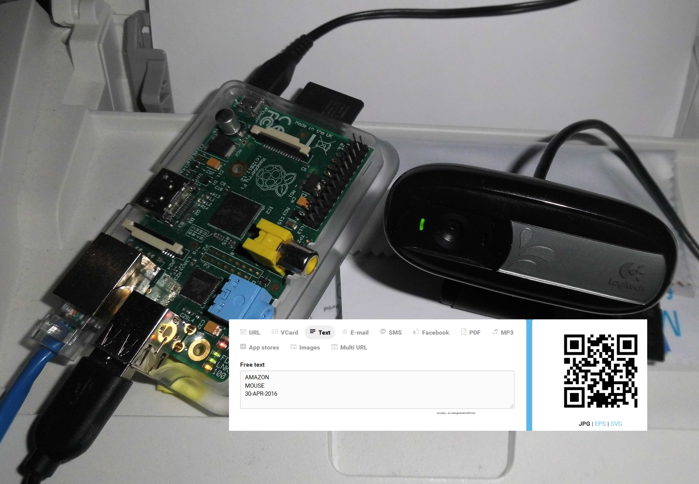
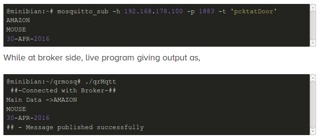

# qrMqtt



`qrMqtt` scans QR codes from a webcam or Raspberry Pi camera and publishes the
decoded content to an MQTT topic. It uses OpenCV for camera capture, ZBar for
QR decoding, and the supported Mosquitto C client API for MQTT publishing.

## Requirements

On Debian, Ubuntu, or Raspberry Pi OS, install the required packages:

```bash
sudo apt update
sudo apt install build-essential pkg-config libopencv-dev libmosquitto-dev libzbar-dev mosquitto mosquitto-clients
```

`mosquitto` is required only when running an MQTT broker on the same device.
The application can also publish to a broker elsewhere on the network.

## Configuration

Set the MQTT client ID, topic, broker address, and port in
[`src/main.cpp`](src/main.cpp):

```cpp
qrMqtt qr2sp("qr2sp", "pcktatDoor", "192.168.178.100", 1883);
```

The constructor arguments are:

1. `qr2sp`: MQTT client ID.
2. `pcktatDoor`: topic to publish scanned QR data to.
3. `192.168.178.100`: MQTT broker hostname or IP address.
4. `1883`: MQTT broker port.

## Build

Build the application from the repository root:

```bash
make
```

The build places intermediate files in `build/` and creates the executable
`./qrMqtt`.

To compile with warnings treated as errors:

```bash
make clean
make CXXFLAGS='-Wall -Wextra -Werror -g -std=c++11'
```

To remove generated output:

```bash
make clean
```

## Run

Start or identify your MQTT broker, connect a camera, then run:

```bash
./qrMqtt
```

For example, watch the default topic from another terminal:

```bash
mosquitto_sub -h 192.168.178.100 -t pcktatDoor -v
```

Each successfully decoded QR value is published with MQTT QoS 2. The
application waits five seconds after a scan before opening the camera again.

## Raspberry Pi Camera

When using a legacy Raspberry Pi camera setup exposed through Video4Linux,
load the camera module before launching the program:

```bash
sudo modprobe bcm2835-v4l2
```

## Project Layout

```text
assets/          Images used by this README
include/qrMqtt/  Public application headers
src/             Application sources
Makefile         Build configuration
LICENSE          GNU GPL v2 license text
```

## Example Output



A demonstration video is available on
[YouTube](https://www.youtube.com/watch?v=1rtJEr5uat0).

## License

This project is distributed under the GNU General Public License, version 2.
See [LICENSE](LICENSE).
